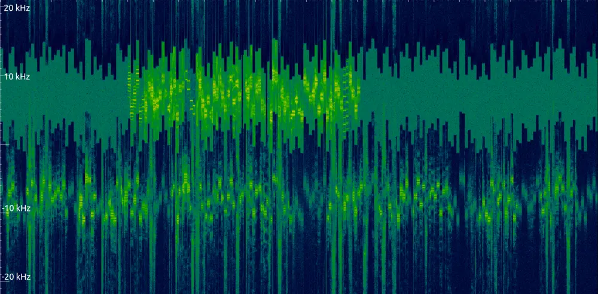
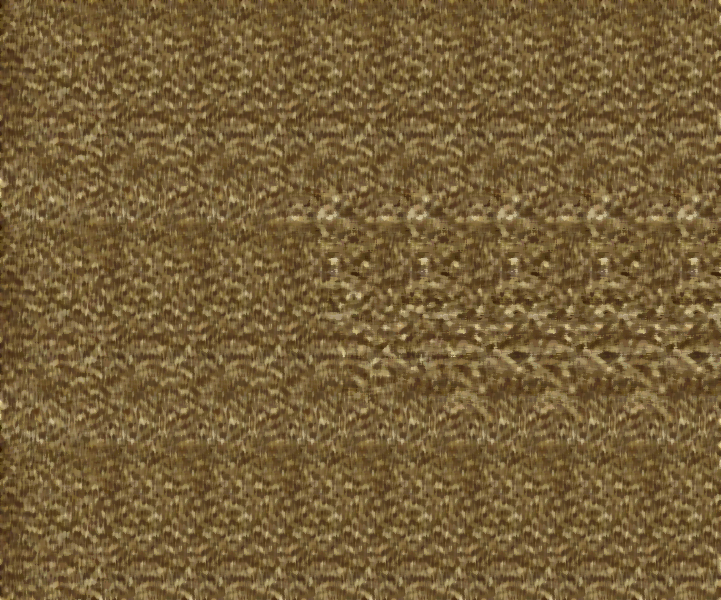

# Challenges for GRCon23

GNU Radio Conference 2023 in Tempe, Arizona the week of 2023-09-05.

## Overview

All of our challenges are independent, but there is a detective story to the flavortext that ties them all together. This year we assigned our puzzles points in the range of (23, 199) based on difficulty.

## Layout

Each challenge has a `public/` folder that holds files facing the challenger, and a `private/` folder with solutions and creation files for the challenge. Please ignore any challenge with a `xxx_` prefix.

## Order of Challenges

All challenges should be released sequentially over the _first_ day at GRCon.

## Links & Prior Art

* A recording of our talk about this work is at _upcoming youtube link_.
* A slide deck showing our explanations [can be found here](https://docs.google.com/presentation/d/1ioPsVzt0WdKOX_6fFdYI2FxYdD3U_w99TLeZ8Mo6R-Q/edit?usp=sharing)
* Our 2022 challenge repository [can be found here](https://github.com/bebau/grcon22).

